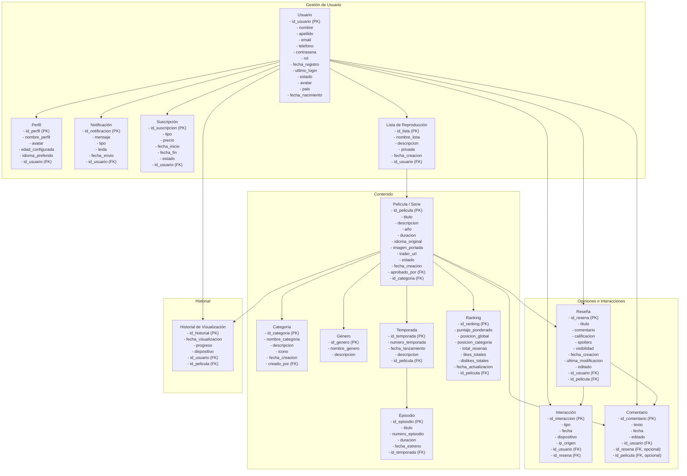
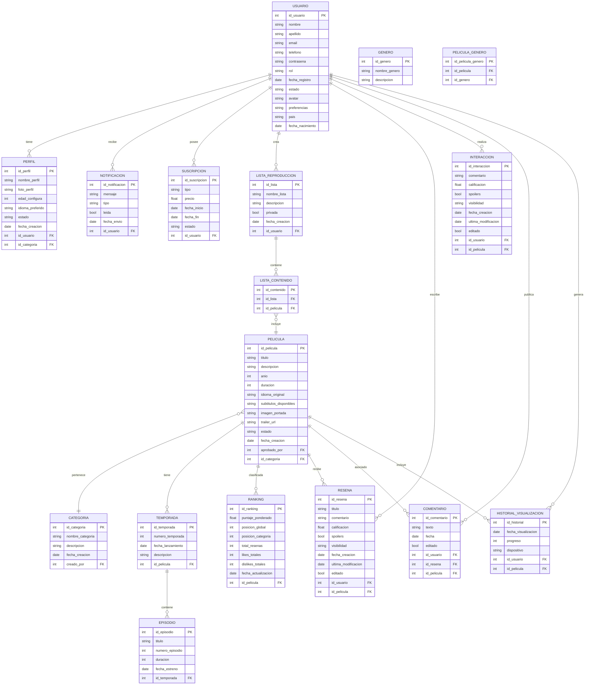
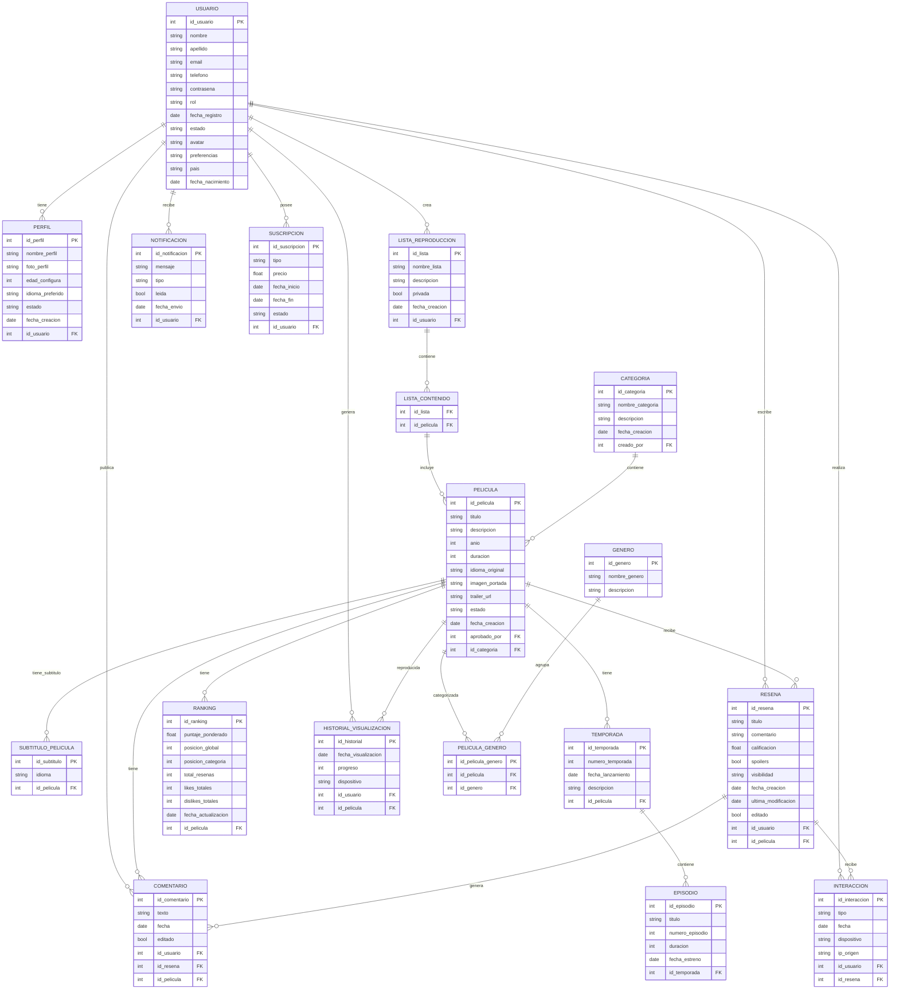
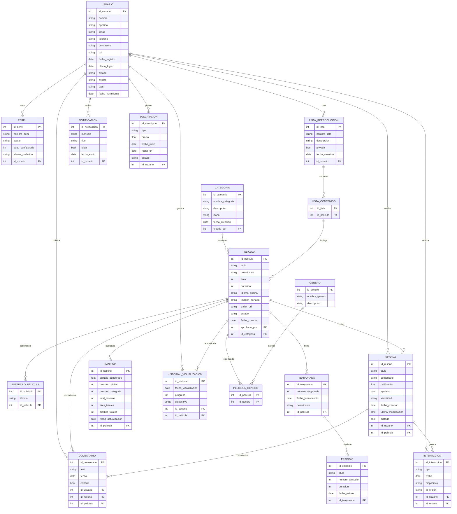
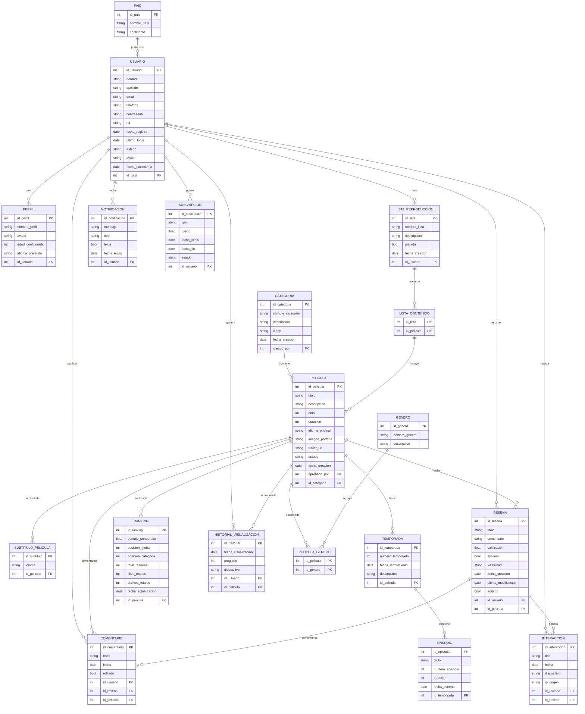

# KARENFLIX

&nbsp;  
&nbsp;  
&nbsp;  
&nbsp;  
&nbsp;  

**Naya Zarela Lizcano Jaimes**
**Aura Camila Pico Araque**

&nbsp;  
&nbsp;  
 
**S1**  
&nbsp;  
&nbsp;  
&nbsp;  

**PEDRO FELIPE GÓMEZ BONILLA**  

&nbsp;  
&nbsp;  
&nbsp;  

**CAMPUSLANDS**  

**Cajasan**  

**RUTA NODEJS**  

**BUCARAMANGA**  

**CAJASAN**

**2025**
 

 
 
 

## Tabla de Contenidos

- [Introducción](#introducción)
- [Caso de Estudio](#caso-de-estudio)
- [Planificación](#planificación)
- [Construcción del Modelo Conceptual](#construcción-del-modelo-conceptual)
  - [Descripción](#descripción)
  - [Gráfica](#gráfica)
  - [Descripción Técnica](#descripción-técnica)
- [Construcción del Modelo Lógico](#construcción-del-modelo-lógico)
  - [Descripción](#descripción-1)
  - [Gráfica](#gráfica-1)
  - [Descripción Técnica](#descripción-técnica-1)
- [Normalización del Modelo Lógico](#normalización-del-modelo-lógico)
  - [Primera Forma Normal (1FN)](#primera-forma-normal-1fn)
    - [Descripción](#descripción-2)
    - [Gráfica](#gráfica-2)
    - [Descripción Técnica](#descripción-técnica-2)
  - [Segunda Forma Normal (2FN)](#segunda-forma-normal-2fn)
    - [Descripción](#descripción-3)
    - [Gráfica](#gráfica-3)
    - [Descripción Técnica](#descripción-técnica-3)
  - [Tercera Forma Normal (3FN)](#tercera-forma-normal-3fn)
    - [Descripción](#descripción-4)
    - [Gráfica](#gráfica-4)
    - [Descripción Técnica](#descripción-técnica-4)
- [Construcción del Modelo Físico](#construcción-del-modelo-físico)
  - [Descripción](#descripción-5)
  - [Código](#código)
  - [Descripción Técnica](#descripción-técnica-5)
- [Diagrama E-R](#diagrama-e-r)
  - [Descripción](#descripción-6)
  - [Gráfica](#gráfica-5)
  - [Descripción Técnica](#descripción-técnica-6)
- [Tablas](#tablas)
  - [Descripción](#descripción-7)
  - [Gráfica](#gráfica-6)
  - [Descripción Técnica](#descripción-técnica-7)
  - [Descripción](#descripción-8)
  - [Gráfica](#gráfica-7)
  - [Descripción Técnica](#descripción-técnica-8)
  - [Gráfica](#gráfica-8)
  - [Descripción Técnica](#descripción-técnica-9)

# INTRODUCCION

    
  <a href="https://docs.google.com/document/d/1KUuhyWSEkjG1GAjTB9Nq3HxgZ9y3pemW/edit?usp=sharing&ouid=114461224375035393571&rtpof=true&sd=true" target="_blank">🔗 Visualizar doc Scrum</a>

# <h2 id="Introducción">Introducción</h2>

Este documento servirá como una guía detallada del proceso completo de diseño, estructuración y desarrollo de una aplicación full stack que permita a los usuarios registrar, clasificar y rankear películas, animes y series geek. El objetivo principal es gestionar eficazmente la búsqueda de las diferentes películas y hacerla más interactiva .
Inicialmente, se analizará el caso de estudio junto con sus requerimientos específicos. A partir de esta investigación, se procederá a desarrollar un modelo conceptual detallado donde se identificarán las entidades principales, sus atributos y las relaciones entre ellas. Este paso determina las bases para comprender la estructura esencial de la aplicación de peliculas.
Después de realizar el modelo conceptual, se realizará la conversión de este modelo dicho al modelo lógico. El modelo lógico  ofrece una representación más precisa de cómo se organizará la información, facilitando una comprensión clara de la base de datos en desarrollo. Se aplicará el proceso de Normalización hasta la tercera forma normal (3FN) para optimizar la organización de los datos, reduciendo redundancias y eliminando dependencias transitivas.
Posteriormente, se llevará a cabo la conversión del modelo lógico al modelo físico, el cual define la implementación real de entidades, atributos y relaciones, incorporando detalles técnicos como los tipos de datos adecuados para cada elemento.
Para mejorar la comprensión del sistema, se incluirá un diagrama UML que visualice de manera gráfica y concisa la estructura de la base de datos y sus relaciones.
Finalmente, se detallarán algunos procedimientos, funciones, consultas, funciones y acceso total, la funcionalidad del sistema de información desarrollado, asegurando así su eficiencia y utilidad para la aplicación que queremos realizar.
Con estos pasos y elementos, se garantiza una guía completa y efectiva para el diseño y desarrollo de la aplicación full-stack (KarenFlix).

# <h2 id="Construcción-del-modelo-conceptual">Construcción del modelo conceptual</h2>

Se diseñó el modelo conceptual identificando cada una de las entidades, sus atributos y las relaciones entre ellas. Este modelo conceptual proporciona una visión clara y estructurada de cómo se organizan y conectan los diferentes elementos de la base de datos para el back-end de la aplicación a realizar.
A continuación veremos cada una de las entidades y atributos necesitados para la base de datos de nuestra app (KarebFlix).
 
 <h3 id="construcción-del-modelo-conceptual">Construcción del modelo conceptual</h3>

<h3 id="Descripcion">Descripción</h3>

<ol>
  <li><strong>Usuario</strong>
    <ul>
      <li><code>id_usuario</code> (PK)</li>
      <li><code>nombre</code></li>
      <li><code>email</code></li>
      <li><code>contrasena</code></li>
      <li><code>rol</code></li>
      <li><code>fecha_registro</code></li>
      <li><code>ultimo_login</code></li>
      <li><code>estado</code></li>
      <li><code>avatar</code></li>
      <li><code>fecha_nacimiento</code></li>
      <li><code>id_pais</code> (FK)</li>
    </ul>
  </li>

  <li><strong>Película / Serie</strong>
    <ul>
      <li><code>id_pelicula</code> (PK)</li>
      <li><code>titulo</code></li>
      <li><code>descripcion</code></li>
      <li><code>anio</code></li>
      <li><code>imagen</code> (opcional)</li>
      <li><code>estado</code> (Pendiente/Aprobado)</li>
      <li><code>fecha_creacion</code></li>
      <li><code>fecha_aprobacion</code> (si aplica)</li>
      <li><code>id_categoria</code> (FK)</li>
    </ul>
  </li>

  <li><strong>Categoría</strong>
    <ul>
      <li><code>id_categoria</code> (PK)</li>
      <li><code>nombre_categoria</code></li>
      <li><code>descripcion</code> (opcional)</li>
      <li><code>fecha_creacion</code></li>
    </ul>
  </li>

  <li><strong>Reseña</strong>
    <ul>
      <li><code>id_resena</code> (PK)</li>
      <li><code>titulo</code></li>
      <li><code>comentario</code></li>
      <li><code>calificacion</code> (1.0 – 5.0 con decimales)</li>
      <li><code>fecha_creacion</code></li>
      <li><code>id_usuario</code> (FK)</li>
      <li><code>id_pelicula</code> (FK)</li>
    </ul>
  </li>

  <li><strong>Like / Dislike</strong>
    <ul>
      <li><code>id_interaccion</code> (PK)</li>
      <li><code>tipo</code> (like/dislike)</li>
      <li><code>fecha</code></li>
      <li><code>id_usuario</code> (FK)</li>
      <li><code>id_resena</code> (FK)</li>
    </ul>
  </li>

  <li><strong>Ranking</strong>
    <ul>
      <li><code>id_ranking</code> (PK)</li>
      <li><code>puntaje_ponderado</code></li>
      <li><code>fecha_actualizacion</code></li>
      <li><code>id_pelicula</code> (FK)</li>
    </ul>
  </li>
</ol>

<h3 id="modelo-logico">Construcción del Modelo Lógico</h3>

Se ha diseñado el modelo lógico teniendo en cuenta el modelo conceptual, incorporando detalles más específicos como las características de cada atributo, incluidas las claves primarias, foráneas y las relaciones de cardinalidad.

<ol>
  <li><strong>Usuario</strong>
    <ul>
      <li><code>id_usuario</code> (PK)</li>
      <li><code>nombre</code></li>
      <li><code>apellido</code></li>
      <li><code>email</code></li>
      <li><code>telefono</code> (único)</li>
      <li><code>contrasena</code> (encriptada)</li>
      <li><code>rol</code> (usuario | administrador)</li>
      <li><code>fecha_registro</code></li>
      <li><code>estado</code> (activo | inactivo | baneado)</li>
      <li><code>avatar</code> (URL)</li>
      <li><code>preferencias</code> (géneros, idiomas, subtítulos)</li>
      <li><code>pais</code></li>
      <li><code>fecha_nacimiento</code></li>
    </ul>
  </li>

  <li><strong>Perfil</strong>
    <ul>
      <li><code>id_perfil</code> (PK)</li>
      <li><code>nombre_perfil</code></li>
      <li><code>foto_perfil</code></li>
      <li><code>edad_configura</code> (control parental)</li>
      <li><code>idioma_preferido</code></li>
      <li><code>estado</code> (pendiente | aprobado)</li>
      <li><code>fecha_creacion</code></li>
      <li><code>id_usuario</code> (FK)</li>
      <li><code>id_categoria</code> (FK)</li>
    </ul>
  </li>

  <li><strong>Categoría</strong>
    <ul>
      <li><code>id_categoria</code> (PK)</li>
      <li><code>nombre_categoria</code></li>
      <li><code>descripcion</code> (opcional)</li>
      <li><code>fecha_creacion</code></li>
      <li><code>creado_por</code> (FK)</li>
    </ul>
  </li>

  <li><strong>Película / Serie</strong>
    <ul>
      <li><code>id_pelicula</code> (PK)</li>
      <li><code>titulo</code> (único)</li>
      <li><code>descripcion</code></li>
      <li><code>anio</code></li>
      <li><code>duracion</code></li>
      <li><code>idioma_original</code></li>
      <li><code>subtitulos_disponibles</code> (JSON)</li>
      <li><code>imagen_portada</code> (URL)</li>
      <li><code>trailer_url</code></li>
      <li><code>estado</code> (pendiente | aprobado | rechazado)</li>
      <li><code>fecha_creacion</code></li>
      <li><code>aprobado_por</code> (FK)</li>
      <li><code>id_categoria</code> (FK)</li>
    </ul>
  </li>

  <li><strong>Temporada</strong>
    <ul>
      <li><code>id_temporada</code> (PK)</li>
      <li><code>numero_temporada</code></li>
      <li><code>fecha_lanzamiento</code></li>
      <li><code>descripcion</code></li>
      <li><code>id_pelicula</code> (FK)</li>
    </ul>
  </li>

  <li><strong>Episodio</strong>
    <ul>
      <li><code>id_episodio</code> (PK)</li>
      <li><code>titulo</code></li>
      <li><code>numero_episodio</code></li>
      <li><code>duracion</code></li>
      <li><code>fecha_estreno</code></li>
      <li><code>id_temporada</code> (FK)</li>
    </ul>
  </li>

  <li><strong>Género</strong>
    <ul>
      <li><code>id_genero</code> (PK)</li>
      <li><code>nombre_genero</code> (único)</li>
      <li><code>descripcion</code></li>
    </ul>
  </li>

  <li><strong>Pelicula_Genero</strong>
    <ul>
      <li><code>id_pelicula_genero</code> (PK)</li>
      <li><code>id_pelicula</code> (FK)</li>
      <li><code>id_genero</code> (FK)</li>
    </ul>
  </li>

  <li><strong>Reseña</strong>
    <ul>
      <li><code>id_resena</code> (PK)</li>
      <li><code>titulo</code></li>
      <li><code>comentario</code></li>
      <li><code>calificacion</code> (1–5)</li>
      <li><code>spoilers</code> (boolean)</li>
      <li><code>visibilidad</code> (pública | privada)</li>
      <li><code>fecha_creacion</code></li>
      <li><code>ultima_modificacion</code></li>
      <li><code>editado</code> (boolean)</li>
      <li><code>id_usuario</code> (FK)</li>
      <li><code>id_pelicula</code> (FK)</li>
    </ul>
  </li>

  <li><strong>Interacción (Like/Dislike)</strong>
    <ul>
      <li><code>id_interaccion</code> (PK)</li>
      <li><code>tipo</code> (like | dislike)</li>
      <li><code>fecha_creacion</code></li>
      <li><code>id_usuario</code> (FK)</li>
      <li><code>id_resena</code> (FK)</li>
    </ul>
  </li>

  <li><strong>Ranking</strong>
    <ul>
      <li><code>id_ranking</code> (PK)</li>
      <li><code>puntaje_ponderado</code></li>
      <li><code>posicion_global</code></li>
      <li><code>posicion_categoria</code></li>
      <li><code>total_resenas</code></li>
      <li><code>likes_totales</code></li>
      <li><code>dislikes_totales</code></li>
      <li><code>fecha_actualizacion</code></li>
      <li><code>id_pelicula</code> (FK)</li>
    </ul>
  </li>

  <li><strong>Lista_Reproducción</strong>
    <ul>
      <li><code>id_lista</code> (PK)</li>
      <li><code>nombre_lista</code></li>
      <li><code>descripcion</code></li>
      <li><code>privada</code> (boolean)</li>
      <li><code>fecha_creacion</code></li>
      <li><code>id_usuario</code> (FK)</li>
    </ul>
  </li>

  <li><strong>Lista_Contenido</strong>
    <ul>
      <li><code>id_contenido</code> (PK)</li>
      <li><code>id_lista</code> (FK)</li>
      <li><code>id_pelicula</code> (FK)</li>
    </ul>
  </li>

  <li><strong>Historial_Visualización</strong>
    <ul>
      <li><code>id_historial</code> (PK)</li>
      <li><code>fecha_visualizacion</code></li>
      <li><code>progreso</code> (minutos vistos)</li>
      <li><code>dispositivo</code> (web | móvil | tv)</li>
      <li><code>id_usuario</code> (FK)</li>
      <li><code>id_pelicula</code> (FK)</li>
    </ul>
  </li>

  <li><strong>Comentario</strong>
    <ul>
      <li><code>id_comentario</code> (PK)</li>
      <li><code>texto</code></li>
      <li><code>fecha</code></li>
      <li><code>editado</code> (boolean)</li>
      <li><code>id_usuario</code> (FK)</li>
      <li><code>id_resena</code> (FK)</li>
      <li><code>id_pelicula</code> (FK)</li>
    </ul>
  </li>

  <li><strong>Notificación</strong>
    <ul>
      <li><code>id_notificacion</code> (PK)</li>
      <li><code>mensaje</code></li>
      <li><code>tipo</code> (sistema | reseña | admin)</li>
      <li><code>leida</code> (boolean)</li>
      <li><code>fecha_envio</code></li>
      <li><code>id_usuario</code> (FK)</li>
    </ul>
  </li>

  <li><strong>Suscripción</strong>
    <ul>
      <li><code>id_suscripcion</code> (PK)</li>
      <li><code>tipo</code> (gratis | premium | vip)</li>
      <li><code>precio</code></li>
      <li><code>fecha_inicio</code></li>
      <li><code>fecha_fin</code></li>
      <li><code>estado</code> (activa | cancelada)</li>
      <li><code>id_usuario</code> (FK)</li>
    </ul>
  </li>
</ol>

<h3 id="normalizacion-1FN">Normalización del Modelo Lógico – 1FN</h3>

La <strong>Primera Forma Normal (1FN)</strong> se aplica para asegurar que:

<ul>
  <li>Todos los atributos contienen valores <strong>atómicos</strong> (indivisibles).</li>
  <li>No existen <strong>campos multivaluados</strong> ni <strong>repetidos</strong>.</li>
  <li>Cada fila es <strong>única e identificable</strong> mediante una clave primaria (PK).</li>
</ul>

<ol>
  <li><strong>Usuario</strong>
    <ul>
      <li><code>id_usuario</code> (PK)</li>
      <li><code>nombre</code></li>
      <li><code>apellido</code></li>
      <li><code>email</code> (único)</li>
      <li><code>telefono</code></li>
      <li><code>contraseña</code> (encriptada)</li>
      <li><code>rol</code> (usuario | administrador)</li>
      <li><code>fecha_registro</code></li>
      <li><code>estado</code> (activo | inactivo | baneado)</li>
      <li><code>avatar</code> (URL)</li>
      <li><code>pais</code></li>
      <li><code>fecha_nacimiento</code></li>
    </ul>
    
<em>Tablas adicionales:</em>

    <ul>
      <li><strong>Preferencia_genero</strong> (<code>id_usuario</code> FK, <code>id_genero</code> FK)</li>
      <li><strong>Preferencia_idioma</strong> (<code>id_usuario</code> FK, <code>idioma</code>)</li>
      <li><strong>Preferencia_subtitulo</strong> (<code>id_usuario</code> FK, <code>idioma</code>)</li>
    </ul>
  </li>

  <li><strong>Perfil</strong>
    <ul>
      <li><code>id_perfil</code> (PK)</li>
      <li><code>nombre_perfil</code></li>
      <li><code>foto_perfil</code></li>
      <li><code>edad_configura</code> (control parental)</li>
      <li><code>idioma_preferido</code></li>
      <li><code>estado</code> (Pendiente | Aprobado)</li>
      <li><code>fecha_creacion</code></li>
      <li><code>id_usuario</code> (FK)</li>
      <li><code>id_categoria</code> (FK)</li>
    </ul>
  </li>

  <li><strong>Categoría</strong>
    <ul>
      <li><code>id_categoria</code> (PK)</li>
      <li><code>nombre_categoria</code></li>
      <li><code>descripcion</code></li>
      <li><code>fecha_creacion</code></li>
      <li><code>creado_por</code> (FK → Usuario)</li>
    </ul>
  </li>

  <li><strong>Película</strong>
    <ul>
      <li><code>id_pelicula</code> (PK)</li>
      <li><code>titulo</code> (único)</li>
      <li><code>descripcion</code></li>
      <li><code>año</code></li>
      <li><code>duracion</code></li>
      <li><code>idioma_original</code></li>
      <li><code>imagen_portada</code> (URL)</li>
      <li><code>trailer_url</code></li>
      <li><code>estado</code> (pendiente | aprobado | rechazado)</li>
      <li><code>fecha_creacion</code></li>
      <li><code>aprobado_por</code> (FK → Usuario)</li>
      <li><code>id_categoria</code> (FK)</li>
    </ul>
  </li>

  <li><strong>Subtitulo_Pelicula</strong>
    <ul>
      <li><code>id_subtitulo</code> (PK)</li>
      <li><code>idioma</code></li>
      <li><code>id_pelicula</code> (FK)</li>
    </ul>
  </li>

  <li><strong>Temporada</strong>
    <ul>
      <li><code>id_temporada</code> (PK)</li>
      <li><code>numero_temporada</code></li>
      <li><code>fecha_lanzamiento</code></li>
      <li><code>descripcion</code></li>
      <li><code>id_pelicula</code> (FK)</li>
    </ul>
  </li>

  <li><strong>Episodio</strong>
    <ul>
      <li><code>id_episodio</code> (PK)</li>
      <li><code>titulo</code></li>
      <li><code>numero_episodio</code></li>
      <li><code>duracion</code></li>
      <li><code>fecha_estreno</code></li>
      <li><code>id_temporada</code> (FK)</li>
    </ul>
  </li>

  <li><strong>Reseña</strong>
    <ul>
      <li><code>id_resena</code> (PK)</li>
      <li><code>titulo</code></li>
      <li><code>comentario</code></li>
      <li><code>calificacion</code> (1–5)</li>
      <li><code>spoilers</code> (boolean)</li>
      <li><code>visibilidad</code> (pública | privada)</li>
      <li><code>fecha_creacion</code></li>
      <li><code>ultima_modificacion</code></li>
      <li><code>editado</code> (boolean)</li>
      <li><code>id_usuario</code> (FK)</li>
      <li><code>id_pelicula</code> (FK)</li>
    </ul>
  </li>

  <li><strong>Interaccion</strong>
    <ul>
      <li><code>id_interaccion</code> (PK)</li>
      <li><code>tipo</code> (like | dislike)</li>
      <li><code>fecha</code></li>
      <li><code>dispositivo</code></li>
      <li><code>ip_origen</code></li>
      <li><code>id_usuario</code> (FK)</li>
      <li><code>id_resena</code> (FK)</li>
    </ul>
  </li>

  <li><strong>Ranking</strong>
    <ul>
      <li><code>id_ranking</code> (PK)</li>
      <li><code>puntaje_ponderado</code></li>
      <li><code>posicion_global</code></li>
      <li><code>posicion_categoria</code></li>
      <li><code>total_resenas</code></li>
      <li><code>likes_totales</code></li>
      <li><code>dislikes_totales</code></li>
      <li><code>fecha_actualizacion</code></li>
      <li><code>id_pelicula</code> (FK)</li>
    </ul>
  </li>

  <li><strong>Lista_Reproduccion</strong>
    <ul>
      <li><code>id_lista</code> (PK)</li>
      <li><code>nombre_lista</code></li>
      <li><code>descripcion</code></li>
      <li><code>privada</code> (boolean)</li>
      <li><code>fecha_creacion</code></li>
      <li><code>id_usuario</code> (FK)</li>
    </ul>
  </li>

  <li><strong>Lista_Contenido</strong>
    <ul>
      <li><code>id_lista</code> (FK)</li>
      <li><code>id_pelicula</code> (FK)</li>
      <li><em>PK compuesta: (id_lista, id_pelicula)</em></li>
    </ul>
  </li>

  <li><strong>Historial_Visualizacion</strong>
    <ul>
      <li><code>id_historial</code> (PK)</li>
      <li><code>fecha_visualizacion</code></li>
      <li><code>progreso</code> (minutos vistos)</li>
      <li><code>dispositivo</code> (web | móvil | tv)</li>
      <li><code>id_usuario</code> (FK)</li>
      <li><code>id_pelicula</code> (FK)</li>
    </ul>
  </li>

  <li><strong>Comentario</strong>
    <ul>
      <li><code>id_comentario</code> (PK)</li>
      <li><code>texto</code></li>
      <li><code>fecha</code></li>
      <li><code>editado</code> (boolean)</li>
      <li><code>id_usuario</code> (FK)</li>
      <li><code>id_resena</code> (FK, opcional)</li>
      <li><code>id_pelicula</code> (FK, opcional)</li>
    </ul>
  </li>

  <li><strong>Notificación</strong>
    <ul>
      <li><code>id_notificacion</code> (PK)</li>
      <li><code>mensaje</code></li>
      <li><code>tipo</code> (sistema | reseña | admin)</li>
      <li><code>leida</code> (boolean)</li>
      <li><code>fecha_envio</code></li>
      <li><code>id_usuario</code> (FK)</li>
    </ul>
  </li>

  <li><strong>Suscripción</strong>
    <ul>
      <li><code>id_suscripcion</code> (PK)</li>
      <li><code>tipo</code> (gratis | premium | vip)</li>
      <li><code>precio</code></li>
      <li><code>fecha_inicio</code></li>
      <li><code>fecha_fin</code></li>
      <li><code>estado</code> (activa | cancelada)</li>
      <li><code>id_usuario</code> (FK)</li>
    </ul>
  </li>

  <li><strong>Genero</strong>
    <ul>
      <li><code>id_genero</code> (PK)</li>
      <li><code>nombre_genero</code> (único)</li>
      <li><code>descripcion</code></li>
    </ul>
  </li>

  <li><strong>Pelicula_Genero</strong>
    <ul>
      <li><code>id_pelicula</code> (FK)</li>
      <li><code>id_genero</code> (FK)</li>
      <li><em>PK compuesta: (id_pelicula, id_genero)</em></li>
    </ul>
  </li>
</ol>

<!DOCTYPE html>
<html lang="es">
<head>
    <meta charset="UTF-8">
    <title>Segunda Forma Normal (2FN)</title>
</head>
<body>

    <h2>Criterios</h2>
    <ul>
        <li>Está en 1FN.</li>
        <li>Todos los atributos no clave (no pertenecientes a una clave primaria compuesta) dependen completamente de la clave primaria.</li>
    </ul>

    <h2>Descripción</h2>
    

        La segunda forma normal, es el segundo nivel de normalización en el diseño de la base de datos
        que se aplicará a las tablas de una base de datos que ya cumplen con la primera forma normal
        y lleva a cabo la eliminación de dependencias parciales dentro de una tabla.
    

    <h2>Descripción Técnica</h2>

    <h3>Usuario</h3>
    <ul>
        <li>id_usuario (PK)</li>
        <li>Nombre</li>
        <li>Apellido</li>
        <li>Email</li>
        <li>Telefono</li>
        <li>Contrasena</li>
        <li>Rol</li>
        <li>Fecha_registro</li>
        <li>Ultimo_login</li>
        <li>Estado</li>
        <li>Avatar</li>
        <li>Pais</li>
        <li>Fecha_nacimiento</li>
    </ul>

    <h3>Perfil</h3>
    <ul>
        <li>id_perfil (PK)</li>
        <li>Nombre_perfil</li>
        <li>Avatar</li>
        <li>Edad_configurada</li>
        <li>Idioma_preferido</li>
        <li>id_usuario (FK)</li>
    </ul>

    <h3>Categoría</h3>
    <ul>
        <li>id_categoria (PK)</li>
        <li>Nombre_categoria</li>
        <li>Descripcion</li>
        <li>Icono</li>
        <li>Fecha_creacion</li>
        <li>creado_por (FK → USUARIO)</li>
    </ul>

    <h3>Película</h3>
    <ul>
        <li>id_pelicula (PK)</li>
        <li>Titulo</li>
        <li>Descripcion</li>
        <li>Año</li>
        <li>Duracion</li>
        <li>Idioma_original</li>
        <li>Imagen_portada</li>
        <li>Trailer_url</li>
        <li>Estado</li>
        <li>Fecha_creacion</li>
        <li>Aprobado_por (FK → USUARIO)</li>
        <li>id_categoria (FK → CATEGORIA)</li>
    </ul>

    <h3>Subtitulo_pelicula</h3>
    <ul>
        <li>id_subtitulo (PK)</li>
        <li>Idioma</li>
        <li>id_pelicula (FK → PELICULA)</li>
    </ul>

    <h3>Temporada</h3>
    <ul>
        <li>id_temporada (PK)</li>
        <li>numero_temporada</li>
        <li>fecha_lanzamiento</li>
        <li>descripcion</li>
        <li>id_pelicula (FK → PELICULA)</li>
    </ul>

    <h3>Episodio</h3>
    <ul>
        <li>id_episodio (PK)</li>
        <li>Titulo</li>
        <li>Numero_episodio</li>
        <li>Duracion</li>
        <li>fecha_estreno</li>
        <li>id_temporada (FK → TEMPORADA)</li>
    </ul>

    <h3>Reseña</h3>
    <ul>
        <li>id_resena (PK)</li>
        <li>Titulo</li>
        <li>Comentario</li>
        <li>Calificacion</li>
        <li>Spoilers</li>
        <li>Visibilidad</li>
        <li>Fecha_creacion</li>
        <li>Ultima_modificacion</li>
        <li>Editado</li>
        <li>id_usuario (FK)</li>
        <li>id_pelicula (FK)</li>
    </ul>

    <h3>Interacción</h3>
    <ul>
        <li>id_interaccion (PK)</li>
        <li>Tipo</li>
        <li>Fecha</li>
        <li>Dispositivo</li>
        <li>ip_origen</li>
        <li>id_usuario (FK)</li>
        <li>id_resena (FK)</li>
    </ul>

    <h3>Ranking</h3>
    <ul>
        <li>id_ranking (PK)</li>
        <li>Puntaje_ponderado</li>
        <li>Posicion_global</li>
        <li>Posicion_categoria</li>
        <li>Total_resenas</li>
        <li>likes_totales</li>
        <li>dislikes_totales</li>
        <li>fecha_actualizacion</li>
        <li>id_pelicula (FK)</li>
    </ul>

    <h3>Lista_reproduccion</h3>
    <ul>
        <li>id_lista (PK)</li>
        <li>Nombre_lista</li>
        <li>Descripcion</li>
        <li>Privada</li>
        <li>Fecha_creacion</li>
        <li>id_usuario (FK)</li>
    </ul>

    <h3>Lista_contenido</h3>
    <ul>
        <li>id_lista (FK, PK)</li>
        <li>id_pelicula (FK, PK)</li>
    </ul>

    <h3>Historial_visualización</h3>
    <ul>
        <li>id_historial (PK)</li>
        <li>fecha_visualizacion</li>
        <li>Progreso</li>
        <li>Dispositivo</li>
        <li>id_usuario (FK)</li>
        <li>id_pelicula (FK)</li>
    </ul>

    <h3>Comentario</h3>
    <ul>
        <li>id_comentario (PK)</li>
        <li>texto</li>
        <li>fecha</li>
        <li>editado</li>
        <li>id_usuario (FK)</li>
        <li>id_resena (FK, opcional)</li>
        <li>id_pelicula (FK, opcional)</li>
    </ul>

    <h3>Notificación</h3>
    <ul>
        <li>id_notificacion (PK)</li>
        <li>Mensaje</li>
        <li>Tipo</li>
        <li>Leida</li>
        <li>fecha_envio</li>
        <li>id_usuario (FK)</li>
    </ul>

    <h3>Suscripción</h3>
    <ul>
        <li>id_suscripcion (PK)</li>
        <li>Tipo</li>
        <li>Precio</li>
        <li>fecha_inicio</li>
        <li>fecha_fin</li>
        <li>Estado</li>
        <li>id_usuario (FK)</li>
    </ul>

    <h3>Género</h3>
    <ul>
        <li>id_genero (PK)</li>
        <li>Nombre_genero</li>
        <li>Descripcion</li>
    </ul>

    <h3>Pelicula_genero</h3>
    <ul>
        <li>id_pelicula (FK, PK)</li>
        <li>id_genero (FK, PK)</li>
    </ul>

</body>
</html>

<h2>Tercera Forma Normal (3FN)</h2>

Una tabla está en 3FN si cumple con los siguientes criterios:

- Está en 2NF. 
- No hay dependencias transitivas: ningún atributo no clave depende de otro atributo no clave.

<h3>Descripción</h3>

  La tercera forma normal es el tercer nivel de normalización en el diseño de la base de datos
  que se aplicará a las tablas que ya cumplen con la segunda forma normal (2NF).
  Se enfoca en la eliminación de dependencias transitivas, evitando que un atributo no clave dependa de otro atributo no clave,
  logrando un diseño más eficiente y reduciendo redundancias en la base de datos.

<h3>Descripción Técnica</h3>

<strong>Usuario</strong> 
id_usuario (PK) 
nombre 
apellido 
email 
telefono 
contrasena 
rol 
fecha_registro 
ultimo_login 
estado 
avatar 
fecha_nacimiento 
id_pais (FK → PAIS)

<strong>Pais</strong> 
id_pais (PK) 
nombre_pais 
continente

<strong>Perfil</strong> 
id_perfil (PK) 
nombre_perfil 
avatar 
edad_configurada 
idioma_preferido 
id_usuario (FK)

<strong>Categoría</strong> 
id_categoria (PK) 
nombre_categoria 
descripcion 
icono 
fecha_creacion 
creado_por (FK → USUARIO)

<strong>Película</strong> 
id_pelicula (PK) 
titulo 
descripcion 
año 
duracion 
idioma_original 
imagen_portada 
trailer_url 
estado 
fecha_creacion 
aprobado_por (FK → USUARIO) 
id_categoria (FK → CATEGORIA)

<strong>Subtitulo_pelicula</strong> 
id_subtitulo (PK) 
idioma 
id_pelicula (FK → PELICULA)

<strong>Temporada</strong> 
id_temporada (PK) 
numero_temporada 
fecha_lanzamiento 
descripcion 
id_pelicula (FK → PELICULA)

<strong>Episodio</strong> 
id_episodio (PK) 
titulo 
numero_episodio 
duracion 
fecha_estreno 
id_temporada (FK → TEMPORADA)

<strong>Reseña</strong> 
id_resena (PK) 
titulo 
comentario 
calificacion 
spoilers 
visibilidad 
fecha_creacion 
ultima_modificacion 
editado 
id_usuario (FK) 
id_pelicula (FK)

<strong>Interacción</strong> 
id_interaccion (PK) 
tipo 
fecha 
dispositivo 
ip_origen 
id_usuario (FK) 
id_resena (FK)

<strong>Ranking</strong> 
id_ranking (PK) 
puntaje_ponderado 
posicion_global 
posicion_categoria 
total_resenas 
likes_totales 
dislikes_totales 
fecha_actualizacion 
id_pelicula (FK)

<strong>Lista_reproduccion</strong> 
id_lista (PK) 
nombre_lista 
descripcion 
privada 
fecha_creacion 
id_usuario (FK)

<strong>Lista_contenido</strong> 
id_lista (FK, PK) 
id_pelicula (FK, PK)

<strong>Historial_visualización</strong> 
id_historial (PK) 
fecha_visualizacion 
progreso 
dispositivo 
id_usuario (FK) 
id_pelicula (FK)

<strong>Comentario</strong> 
id_comentario (PK) 
texto 
fecha 
editado 
id_usuario (FK) 
id_resena (FK, opcional) 
id_pelicula (FK, opcional)

<strong>Notificación</strong> 
id_notificacion (PK) 
mensaje 
tipo 
leida 
fecha_envio 
id_usuario (FK)

<strong>Suscripción</strong> 
id_suscripcion (PK) 
tipo 
precio 
fecha_inicio 
fecha_fin 
estado 
id_usuario (FK)

<strong>Género</strong> 
id_genero (PK) 
nombre_genero 
descripcion

<strong>Pelicula_genero</strong> 
id_pelicula (FK, PK) 
id_genero (FK, PK)

